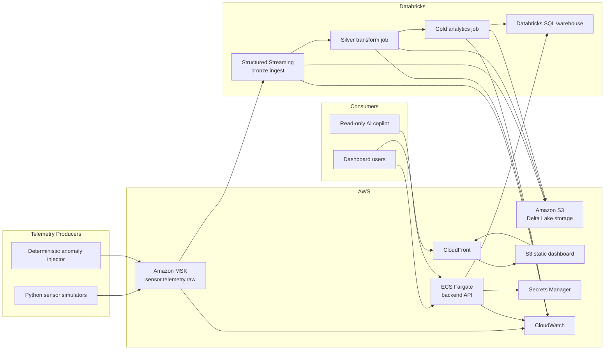
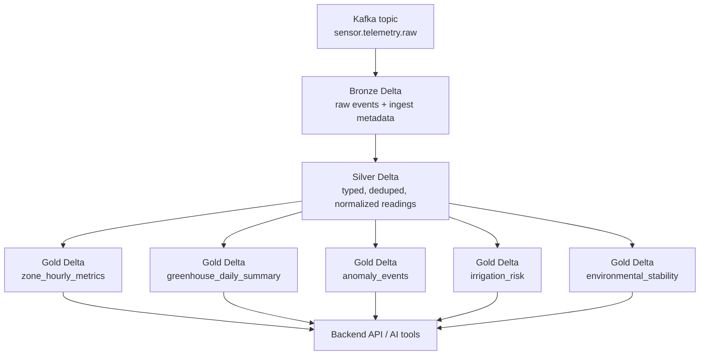
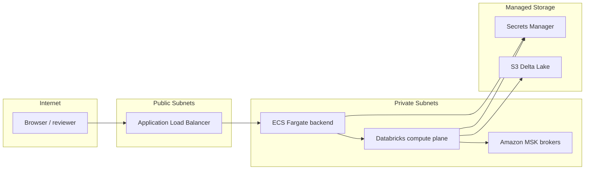

# Greenhouse Sensor Analytics Infrastructure

## Purpose
This file fully defines the v1 infrastructure for the greenhouse sensor analytics platform described in [PLAN.MD](C:\Users\aarus\OneDrive\Documents\sensor%20analysis\PLAN.MD). It keeps the project centered on `Databricks`, `Spark`, `Kafka`, and `AWS`, with `S3 + Delta Lake` as the system of record and a read-only AI layer.

## v1 Decisions
- Cloud: `AWS`
- Streaming backbone: `Amazon MSK`
- Distributed compute: `Databricks` with `Spark Structured Streaming`
- System of record: `Amazon S3` + `Delta Lake`
- Catalog: `Unity Catalog` if enabled in the Databricks workspace; otherwise `AWS Glue Data Catalog`
- Backend runtime: `AWS ECS Fargate`
- Frontend runtime: `S3 + CloudFront`
- AI runtime: backend-hosted tool-calling service with read-only access to gold tables
- Secrets: `AWS Secrets Manager`
- Monitoring: `CloudWatch` for AWS services, Databricks job metrics for Spark pipelines

## Scope Boundary
Included in v1:
- Synthetic greenhouse telemetry generation
- Kafka ingest path
- Bronze, silver, and gold lakehouse layers
- Deterministic anomaly injection
- Backend API for dashboard and AI tools
- Static dashboard hosting
- Read-only AI copilot grounded in backend query outputs

Not included in v1:
- Write-back control loops to greenhouse devices
- Black-box predictive ML
- Multi-region disaster recovery
- RDS serving cache
- Kubernetes

## High-Level Architecture

## AWS Layout

### Region
- Primary region: `us-east-1`
- Reason: broad Databricks and MSK support, common portfolio default, simple service availability

### Account Layout
- One AWS account is enough for v1 demo and portfolio use
- Separate resources by environment prefix instead of multiple accounts:
  - `sensor-dev-*`
  - `sensor-demo-*`

### Networking
- One VPC: `sensor-vpc`
- CIDR: `10.20.0.0/16`
- Three private subnets for stateful/data services:
  - `10.20.1.0/24`
  - `10.20.2.0/24`
  - `10.20.3.0/24`
- Two public subnets for ALB/NAT if needed:
  - `10.20.10.0/24`
  - `10.20.11.0/24`
- Internet Gateway attached to the VPC
- NAT Gateway only if private workloads need outbound internet

### Network Placement
- `Amazon MSK`: private subnets only
- `Databricks` data plane: private subnets where supported by workspace setup
- `ECS Fargate backend`: private subnets behind a public ALB
- `S3`: private access via VPC endpoints where possible
- Dashboard static site: public via CloudFront, origin in S3

### Security Groups
- `sg-msk`
  - inbound `9092/9094` only from simulator runtime and Databricks/ECS clients
  - no public ingress
- `sg-databricks`
  - outbound to MSK brokers, S3, CloudWatch, Secrets Manager
- `sg-backend`
  - inbound from ALB on app port `8080`
  - outbound to Databricks SQL warehouse, Secrets Manager, CloudWatch
- `sg-alb`
  - inbound `443` from internet
  - outbound to backend target group

## Core Infrastructure Components

### 1. Telemetry Producers
- Runtime: Python application
- Deployment options:
  - local for development
  - ECS Fargate scheduled task for demo runs
- Responsibility:
  - generate greenhouse, zone, and sensor telemetry
  - inject deterministic anomalies
  - publish JSON events to Kafka

### 2. Amazon MSK
- Cluster name: `sensor-msk`
- Broker count: `3`
- Kafka version: current MSK-supported stable line at provisioning time
- Topic:
  - `sensor.telemetry.raw`
- Partitions:
  - start with `12`
- Replication factor:
  - `3`
- Retention:
  - `3` days
- Message format:
  - JSON in v1
- Partition key:
  - `greenhouse_id:zone_id:sensor_id`

Reason for the topic shape:
- enough parallelism for Spark ingestion
- ordering stays stable per sensor stream
- simple to reason about in demos

### 3. Databricks Workspace
- One workspace: `sensor-dbx`
- Primary responsibilities:
  - Spark Structured Streaming ingest from Kafka
  - Delta Lake bronze/silver/gold pipelines
  - scheduled analytics jobs
  - SQL warehouse for backend reads

Workspace assets:
- cluster policy for small/controlled demo compute
- one job per pipeline stage
- one SQL warehouse for backend and analyst queries

### 4. S3 Data Lake
- Bucket: `sensor-data-lake-<suffix>`
- Bucket layout:
  - `delta/bronze/sensor_events/`
  - `delta/silver/sensor_readings/`
  - `delta/gold/zone_hourly_metrics/`
  - `delta/gold/greenhouse_daily_summary/`
  - `delta/gold/anomaly_events/`
  - `delta/gold/irrigation_risk/`
  - `delta/gold/environmental_stability/`
  - `checkpoints/bronze_ingest/`
  - `checkpoints/silver_transform/`
  - `checkpoints/gold_analytics/`
  - `artifacts/simulator/`

S3 rules:
- versioning enabled
- server-side encryption enabled
- public access blocked
- lifecycle rule can move old artifacts/checkpoints if needed, but keep raw data in standard storage for demos

### 5. Backend API
- Runtime: `ECS Fargate`
- Service name: `sensor-api`
- Container listens on `8080`
- Exposed through an Application Load Balancer
- Responsibilities:
  - serve dashboard API endpoints
  - execute read-only queries against Databricks SQL
  - expose AI tool functions
  - return pipeline status and anomaly summaries

### 6. Frontend
- Build target: static single-page app
- Hosting:
  - `S3` bucket for assets
  - `CloudFront` distribution for HTTPS delivery
- Authentication is optional for a private portfolio demo; if public, keep the API read-only and non-destructive

### 7. AI Copilot
- Runs inside the backend service, not as a separate infrastructure tier
- Allowed tools:
  - `get_zone_history`
  - `get_greenhouse_summary`
  - `get_recent_anomalies`
  - `get_top_risk_zones`
  - `get_pipeline_status`
- Hard rule:
  - AI only reads backend query results
  - AI never writes to lakehouse tables or infrastructure

## Data Flow

## Data Contracts

### Kafka Event Schema
Topic: `sensor.telemetry.raw`

Required fields:
- `event_id`
- `event_ts`
- `sensor_id`
- `greenhouse_id`
- `zone_id`
- `metric_family`
- `temperature_c`
- `humidity_pct`
- `soil_moisture_pct`
- `co2_ppm`
- `light_lux`
- `battery_level`
- `fan_status`
- `irrigation_status`
- `location_status`
- `is_injected_anomaly`
- `anomaly_type`

Rules:
- `event_id` unique per event
- timestamps in UTC
- one event contains the full sensor reading snapshot
- anomalies are marked explicitly for demo traceability

### Bronze Table
Table: `bronze.sensor_events`

Columns:
- raw payload
- Kafka metadata: topic, partition, offset
- ingest timestamp
- source event timestamp

### Silver Table
Table: `silver.sensor_readings`

Columns:
- parsed sensor fields
- normalized units
- dedupe marker
- date/hour partitions
- derived flags for missing data and device health

### Gold Tables
- `gold.zone_hourly_metrics`
- `gold.greenhouse_daily_summary`
- `gold.anomaly_events`
- `gold.irrigation_risk`
- `gold.environmental_stability`

## Pipeline Jobs

### Job 1: `stream_ingest_job`
- Type: Spark Structured Streaming
- Reads from MSK topic `sensor.telemetry.raw`
- Writes to `bronze.sensor_events`
- Stores checkpoint in `s3://.../checkpoints/bronze_ingest/`
- Trigger: continuous or short micro-batch

### Job 2: `silver_transform_job`
- Type: Spark job
- Reads from bronze
- Parses JSON
- applies schema validation
- drops malformed or duplicate records
- standardizes timestamps and status fields
- writes to `silver.sensor_readings`
- Trigger: continuous micro-batch or every 5 minutes

### Job 3: `gold_analytics_job`
- Type: Spark job
- Reads from silver
- computes aggregates and anomaly logic
- writes to gold tables
- Trigger: every 5 minutes for demo freshness

### Job 4: `pipeline_health_job`
- Type: lightweight scheduled job
- Checks:
  - Kafka lag
  - latest bronze write time
  - latest gold refresh time
  - count of active simulators
- Writes a small status record consumed by `GET /pipeline/status`

## Anomaly Logic
Use deterministic and explainable rules only:
- temperature out of greenhouse threshold band
- humidity drift outside expected band
- soil moisture below irrigation threshold
- CO2 above or below expected operating range
- light too low or too high for configured period
- missing data for a sensor over a defined interval
- battery degradation below threshold
- multi-signal zone instability when several metrics drift together

Implementation rule:
- thresholds live in versioned config checked into the repo
- no model training infrastructure is required for v1

## API Surface
Backend endpoints:
- `GET /metrics/overview`
- `GET /greenhouses/{greenhouse_id}/summary`
- `GET /zones/{zone_id}/history`
- `GET /anomalies`
- `GET /pipeline/status`
- `POST /agent/chat`

Query path:
- backend issues parameterized read-only queries to Databricks SQL
- results are returned to the dashboard or AI layer

## Security Model

### IAM
- Databricks role:
  - read/write to the S3 data lake prefixes
  - read from Secrets Manager values needed for Kafka/auth config
- ECS task role:
  - read-only access to Databricks credentials in Secrets Manager
  - write logs to CloudWatch
- Simulator task role:
  - write logs to CloudWatch
  - read Kafka connection secrets if auth is enabled

### Secrets
Store in `AWS Secrets Manager`:
- Databricks host
- Databricks token or service principal credentials
- Kafka auth config if used
- backend app secrets

### Encryption
- S3 encryption enabled
- MSK encryption at rest and in transit enabled
- HTTPS on CloudFront and ALB
- TLS to Databricks SQL endpoints

## Observability
- CloudWatch log groups:
  - `/sensor/simulators`
  - `/sensor/api`
  - `/sensor/ecs`
- Databricks job monitoring:
  - ingest throughput
  - failed batch count
  - watermark delay
  - job run duration
- Core alerts:
  - no new bronze data for 10 minutes
  - no gold refresh for 15 minutes
  - backend 5xx rate above threshold
  - Kafka consumer lag above threshold

## Deployment Layout

### Environment Names
- `dev`: local simulator, lower-scale testing
- `demo`: full 1M+ event run and portfolio demos

### Naming Convention
- Prefix all resources with `sensor-`
- Examples:
  - `sensor-msk`
  - `sensor-dbx`
  - `sensor-api`
  - `sensor-dashboard`
  - `sensor-data-lake-<suffix>`

## Network Diagram

## Throughput Target
- Simulators: `1,000` to `10,000` virtual sensors
- Total events: `1M+`
- Expected event shape: small JSON payload per reading
- Start with one event every `15` to `60` seconds per sensor depending on demo scale
- Adjust partitions and Databricks cluster size only if measured lag demands it

This is the lazy scaling rule:
- start with `12` Kafka partitions and small Databricks compute
- scale only after observing backlog or slow gold refresh

## What To Build First
1. Sensor simulator with deterministic anomaly injection
2. Kafka topic and producer wiring
3. `stream_ingest_job` into bronze Delta
4. Silver transform
5. Gold analytics
6. Backend API
7. Static dashboard
8. Read-only AI chat

## Explicit Non-Goals For v1
- No control-plane writes from AI
- No generic IoT abstractions
- No extra database unless Databricks SQL proves too slow for demos
- No second queue, second lake, or second compute engine

## Minimal Resource Checklist
- 1 VPC
- 1 MSK cluster
- 1 Databricks workspace
- 1 S3 data lake bucket
- 1 ECS backend service
- 1 ALB
- 1 S3 frontend bucket
- 1 CloudFront distribution
- 1 Secrets Manager namespace
- 4 Databricks jobs

That is enough for a strong portfolio build without turning the repo into enterprise sprawl.
