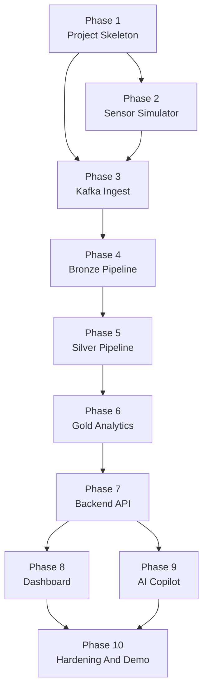

# Sensor Analysis Roadmap

## Purpose
This file is the top-level execution index for the greenhouse sensor analytics platform. It does not contain the full phase details. Each phase has its own file and that phase file is the execution contract for that part of the build.

Use this with:
- [PLAN.MD](../PLAN.MD)
- [INFRASTRUCTURE.md](../INFRASTRUCTURE.md)

## Global Rules
- Work one phase at a time.
- Use the current phase file plus the immediately previous phase file as the main implementation context.
- If a required artifact already exists from a previous phase, extend it in place. Do not create a second version in a new folder.
- Do not create alternate schemas, alternate configs, alternate simulators, alternate APIs, or alternate dashboards unless the user explicitly asks for a replacement.
- If a phase says to reuse a file from an earlier phase, that reuse is mandatory.
- If implementation diverges from the plan, update the relevant phase file in the same change set.

## Canonical Repo Layout
The first phase establishes these canonical top-level paths. Later phases must reuse them.

- `simulator/`
- `pipeline/bronze/`
- `pipeline/silver/`
- `pipeline/gold/`
- `backend/`
- `dashboard/`
- `shared/schemas/`
- `shared/config/`
- `shared/data/`
- `PLANNING/`

No later phase should create replacement top-level folders like `service/`, `api2/`, `ui-new/`, `etl/`, or `common/` if the canonical folder already exists and fits the need.

## Status Tracker
| Phase | File | Main Output | Status |
|---|---|---|---|
| 1 | [PHASE-01-project-skeleton.md](./PHASE-01-project-skeleton.md) | Canonical repo structure and shared contracts | Complete |
| 2 | [PHASE-02-sensor-simulator.md](./PHASE-02-sensor-simulator.md) | Deterministic greenhouse event generator | Not started |
| 3 | [PHASE-03-kafka-ingest.md](./PHASE-03-kafka-ingest.md) | Kafka producer wiring and raw topic flow | Not started |
| 4 | [PHASE-04-bronze-pipeline.md](./PHASE-04-bronze-pipeline.md) | Bronze Spark ingest job and raw Delta table | Not started |
| 5 | [PHASE-05-silver-pipeline.md](./PHASE-05-silver-pipeline.md) | Typed, deduped, normalized silver layer | Not started |
| 6 | [PHASE-06-gold-analytics.md](./PHASE-06-gold-analytics.md) | Gold aggregates, anomalies, and risk tables | Not started |
| 7 | [PHASE-07-backend-api.md](./PHASE-07-backend-api.md) | Read-only API over gold outputs | Not started |
| 8 | [PHASE-08-dashboard.md](./PHASE-08-dashboard.md) | Dashboard using the existing backend API | Not started |
| 9 | [PHASE-09-ai-copilot.md](./PHASE-09-ai-copilot.md) | Grounded read-only copilot using the existing API/query layer | Not started |
| 10 | [PHASE-10-hardening-and-demo.md](./PHASE-10-hardening-and-demo.md) | End-to-end validation and demo package | Not started |

## Allowed AI Execution Scope
- One AI run should usually do one phase.
- A follow-up run may finish the verification or minor cleanup for that same phase.
- Do not ask one run to implement Phases 2 through 6 together.
- Do not start a later phase until the earlier phase has produced the named handoff artifacts in its phase file.

## Dependency Map

## Definition Of Done For Any Phase
A phase is only done when all of these are true:
- the files named in that phase file exist
- the reusable artifacts named in that phase file are the ones later phases will consume
- the verification steps in that phase file have been run or are runnable
- the handoff artifacts for the next phase are explicit

This roadmap stays short on purpose. The detail lives in the phase files.
